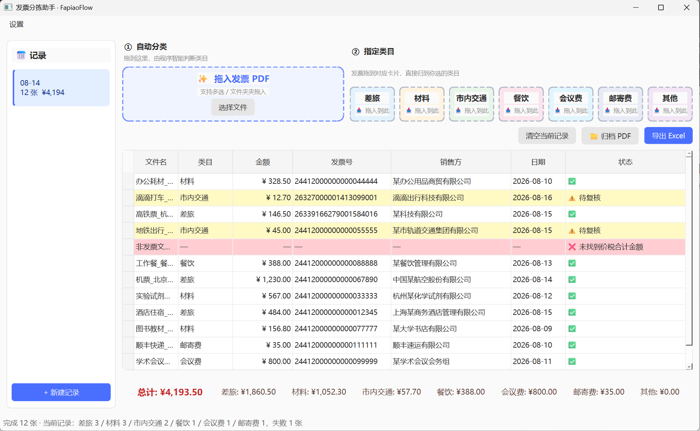
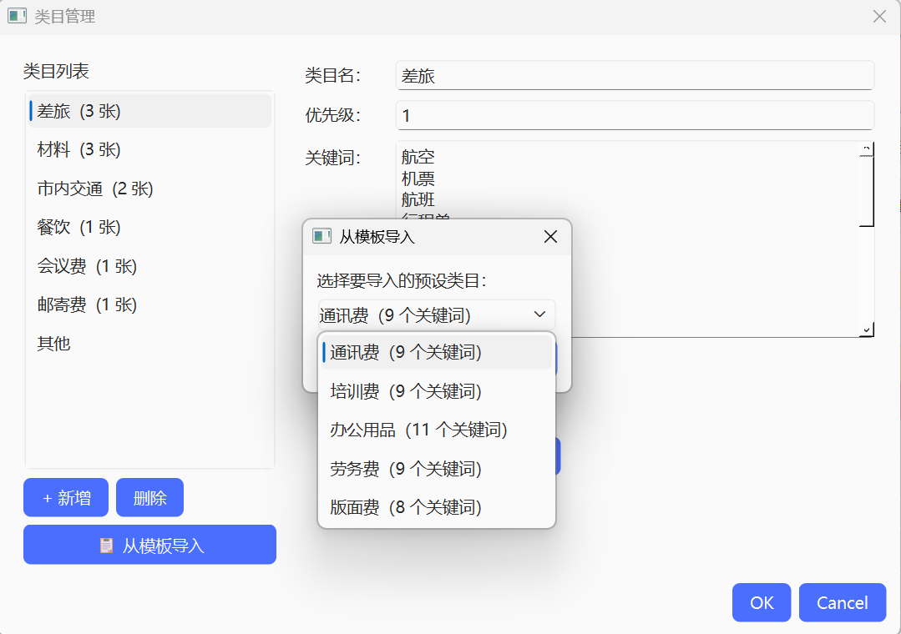
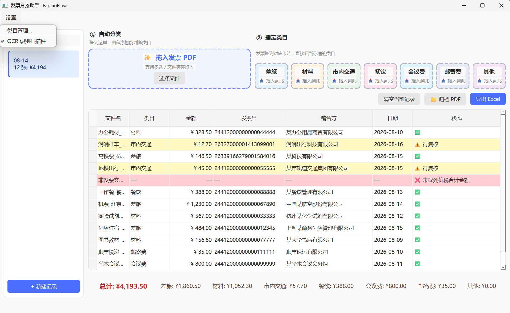

# FapiaoFlow · 发票分拣助手

> 拖拽即分类的电子发票报销工具，面向需要批量整理电子发票的场景（默认配置面向高校师生报销）。

把电子发票 PDF 拖进窗口，自动提取金额/发票号/销售方、按规则分类、实时算各类小计与总计。专为零依赖、开箱即用设计——本地运行、不上传任何发票数据。

## 截图



*主界面：拖入 12 张发票后自动分类。白色行=已分类，黄色行=待复核（市内交通），绿色行=用户手动归类，红色行=解析失败。底部汇总栏实时显示各类小计与总计。*

## 适用场景

- 每学期报销时，把十几张电子发票按"市内交通/差旅/材料/其他"分类、算各类金额小计
- 增值税电子普通发票（含携程、滴滴、京东、酒店电子票）
- 扫描件/拍照件（v0.3.0 新增 OCR 识别）
- 一次拖入 10-20 张批量处理

## 类目设计

工具**默认提供 4 个类目**，并支持用户在「设置 → 类目管理」中自由增删改：

| 类目 | 含义 | 默认关键词示例 |
|------|------|----------------|
| 差旅 | 跨城交通（高铁/机票）+ 住宿 | 航空、机票、航班、高铁、火车、酒店、宾馆、住宿… |
| 材料 | 办公/实验/仪器/图书 | 商贸、办公、仪器、试剂、电脑、图书… |
| 市内交通 | 出租/公交/地铁/网约车 | 出租、网约车、滴滴、公交、地铁… |
| 其他 | 兜底类目 | （无关键词） |

**自定义类目**：你可以新增任意类目（如"餐饮""会议费"），为每个类目配置关键词、按钮颜色、优先级。规则分类器会自动用你配置的关键词匹配。详见下方「自定义类目」章节。

## 快速开始

### 安装

需要 Python 3.10+。

```bash
git clone https://github.com/songzaiyang7-maker/FapiaoFlow.git
cd FapiaoFlow
python -m venv .venv
.venv\Scripts\activate        # Windows
# source .venv/bin/activate   # macOS/Linux
pip install -r requirements.txt
```

### 运行

```bash
python main.py
```

### 使用流程

1. 把电子发票 PDF 拖入窗口（支持多选/文件夹）
2. 等待自动解析（4 线程并发，20 张约 3 秒）
3. 黄色行的发票请确认分类是否正确——不对请双击类目单元格修改，或拖到具体类目按钮
4. 检查底部汇总栏的各类小计与总计
5. 点击"导出 Excel"生成报销汇总表

## 自定义类目

通过「设置 → 类目管理」打开管理对话框：



*左侧类目列表（显示各类目的发票张数），右侧编辑面板（可改名称/优先级/关键词/颜色）。底部「📋 从模板导入」一键导入预设类目。*

- **📋 从模板导入**：内置 8 个常见报销类目（餐饮/会议费/通讯费/培训费/邮寄费/办公用品/劳务费/版面费），每个带现成关键词，一键导入无需手动输入
- **新增类目**：点"+ 新增"，填写类目名、关键词（每行一个）、按钮颜色、优先级
- **改名**：直接在右侧编辑面板修改类目名（历史发票会自动跟着改）
- **改关键词**：编辑右侧文本框，每行一个关键词
- **删除类目**：选中后点"删除"。若当前有发票属于该类，会提示你选迁移目标
- **优先级**：数字越小越优先。多个类目同时命中关键词时，按优先级决定归属

类目配置保存在 `data/categories.json`（打包后位于 `~/.fapiaoflow/categories.json`），可直接编辑该文件批量修改。

## 业务规则说明

默认配置的设计意图：

1. **住宿发票归差旅**——住宿几乎都伴随出差
2. **市内交通默认归类但提示复核**——电子发票（尤其滴滴/网约车）的销售方注册地≠实际乘车地（如滴滴注册在天津/深圳），程序无法可靠判定城市。所以默认归"市内交通"并黄色提示，用户把外地发票手动改类目

如果这套规则不符合你的报销口径，直接在「类目管理」里改——比如把"市内交通"改名成"本地打车"，或新增"市外交通"类目。

## LLM 兜底（DeepSeek API）

工具默认采用 **hybrid 模式**：规则优先，置信度低于 0.7 时调用 DeepSeek API 兜底。这样既保持本地零成本，又能在规则覆盖不到时获得 LLM 帮助。

### 配置

1. 复制 `.env.example` 为 `.env`：
   ```bash
   copy .env.example .env
   ```

2. 在 `.env` 填入你的 DeepSeek API key（[申请地址](https://platform.deepseek.com/)）：
   ```
   DEEPSEEK_API_KEY=sk-your-key-here
   DEEPSEEK_MODEL=deepseek-chat
   CLASSIFIER_BACKEND=hybrid
   LLM_FALLBACK_THRESHOLD=0.7
   ```

3. 启动应用即可。规则命中时不会调 LLM，节省费用。

### Backend 模式

| 模式 | 行为 | 适用场景 |
|------|------|---------|
| `hybrid`（默认） | 规则先跑，conf<0.7 调 LLM | 日常使用 |
| `rule` | 只用规则，零成本 | 没 API key / 完全离线 |
| `llm` | 只用 LLM（每次都调） | 调试 / 评估 LLM 准确率 |

### 隐私

- 发票文本仅发送给 DeepSeek 处理，不会存储到 DeepSeek 之外
- 不上传原始 PDF 文件，只上传提取后的文本片段（前 1500 字）
- API key 仅保存在本地 `.env` 文件，不上传 git

## 后端架构

```
main.py                       # 入口
src/
├── core/
│   ├── types.py              # Invoice / Session 数据类（category 为字符串）
│   ├── categories.py         # CategoryDef + CategoryStore（类目配置，可自定义）
│   ├── config.py             # .env 配置加载
│   ├── parser.py             # PDF → 文本（pdfplumber）
│   ├── extractor.py          # 文本 → 金额/发票号/日期/销售方
│   ├── classifier.py         # 规则分类器（关键词来自类目配置）
│   ├── llm_classifier.py     # DeepSeek API 分类器（prompt 动态生成）
│   ├── hybrid_classifier.py  # 规则优先 + LLM 兜底
│   ├── totals.py             # 汇总计算
│   ├── pipeline.py           # 单票完整处理流程
│   ├── storage.py            # Session 持久化（JSON）
│   └── exporter.py           # Excel 导出
├── gui/
│   ├── main_window.py        # 主窗口
│   ├── category_dialog.py    # 类目管理对话框（增/删/改名/改关键词）
│   ├── category_drop.py      # 拖到具体类目的按钮栏
│   ├── drop_zone.py          # 拖拽组件
│   ├── table_model.py        # QAbstractTableModel
│   ├── delegates.py          # 类目列 ComboBox 编辑器
│   ├── session_panel.py      # 左侧记录导航
│   ├── workers.py            # QRunnable 并发任务
│   └── styles.py             # 配色与样式表
└── utils/
    └── amount.py             # 金额提取（含红字发票负数支持）
```

## 测试

```bash
pytest
```

75 个单元/集成测试，覆盖金额提取（含红字发票）、字段提取、规则分类、LLM 分类（mock）、hybrid 决策、汇总计算、Session 持久化、类目配置、端到端 PDF 解析。集成测试默认跑 rule-only 路径，不消耗 API 费用。

## 打包为单 exe

```bash
pip install pyinstaller
pyinstaller --onefile --windowed --name FapiaoFlow main.py
```

生成 `dist/FapiaoFlow.exe`，可在未装 Python 的 Windows 上双击运行。

## v0.3.0 新功能：OCR 识别 + PDF 归档



### 🔍 OCR 扫描件识别

纸质发票拍照件、扫描 PDF 现在也能自动识别了：
- 电子发票走 pdfplumber 快速文本提取（不变）
- 扫描件（文字提取为空）自动触发 OCR（RapidOCR，本地离线，无需联网）
- 「设置 → OCR 识别扫描件」可开关

### 📁 PDF 归档

按类目把发票复制到子文件夹，一键生成交给财务的归档包：
- 点「📁 归档 PDF」按钮，选输出目录
- 自动创建 `差旅/`、`材料/`、`市内交通/` 等子文件夹，把 PDF 复制进去
- 解析失败的发票放 `未分类/`
- 生成 `归档清单.csv`（文件名/类目/金额/发票号/状态）
- 只复制不移动，原始 PDF 不动

## 后续规划

- 更多发票类型支持（行程单、火车票明细字段）
- 跨城交通发票的城市识别（行程单/火车票有出发到达地，相对可靠）
- 设置对话框：UI 上切换 backend 模式（rule/hybrid/llm）
- 在线 OCR API（百度/腾讯发票识别，更高精度可选增强）

## 贡献

欢迎贡献关键词字典、提 issue 反馈实际报销中的边界情况。详见 [CONTRIBUTING.md](CONTRIBUTING.md)。

## License

[MIT](LICENSE)
